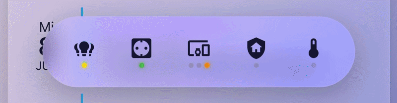

# 🧊 Liquid Lens Navbar Card

A bottom navigation bar for Home Assistant dashboards with an **iOS-26-style
"liquid glass" lens** that follows your finger as you drag across the bar —
plus per-route status dots, a live value readout, JS-templated icon
colors/pulse, a persistent active-route highlight, and a scrollable bar for
displays that can't fit every route at once.

- Drag across the bar and a frosted glass lens tracks your finger, with a
  soft light-refraction fringe at the edges
- Icons switch popups as the lens settles on them — no need to lift your
  finger, just drag and let go on whatever you want (see
  [Navigation timing](#navigation-timing-hover_delay--release_only) for how
  that "settling" behaves and how to tune or disable it)
- Optional colored status dots per route (e.g. "is anything running?"),
  each driven by its own JS template evaluated against live entity states
- Optional icon recoloring the same way (`icon_color`), plus the icon
  symbol itself can be templated (`icon`)
- Optional live value readout per route (`value_entity`/`value_color`) —
  e.g. current solar production wattage under a Solar icon
- Optional pulsing icon (`pulse`) for anything that needs attention, e.g. a
  triggered alarm
- The currently open route is highlighted persistently, independent of the
  drag-hover highlight
- If routes don't fit in the available width, the bar scrolls
  horizontally — drag the lens to the edge and it keeps auto-scrolling
- Light haptic pulse (native on the Companion App, `navigator.vibrate`
  fallback in-browser) as the lens crosses into a new icon
- Theme-aware: icons use `var(--primary-text-color)`, so they stay legible
  in both light and dark themes



> Built for and tested against Home Assistant's `sections` dashboard type,
> alongside [Bubble Card](https://github.com/Clooos/Bubble-Card) pop-ups
> for navigation targets. It doesn't depend on Bubble Card, but the
> hash-based `#my-popup` navigation style matches how Bubble Card pop-ups
> listen for hash changes.

## Installation

### HACS (custom repository)

1. HACS → the `⋮` menu (top right) → **Custom repositories**
2. Add this repository's URL, category **Dashboard**
3. Install **Liquid Lens Navbar Card**, then reload your browser

### Manual

1. Download `liquid-lens-navbar-card.js` from this repo
2. Copy it to `<config>/www/liquid-lens-navbar-card.js`
3. Settings → Dashboards → Resources → add resource:
   - URL: `/local/liquid-lens-navbar-card.js`
   - Type: JavaScript Module
4. Hard-refresh your browser (and fully restart the Companion App if you
   use it, since it caches resources more aggressively than a browser tab)

## Basic usage

```yaml
type: custom:liquid-lens-navbar-card
routes:
  - icon: mdi:lightbulb-group
    label: Lights
    tap_action:
      action: navigate
      navigation_path: "#lights-popup"
  - icon: mdi:power-socket-de
    label: Outlets
    tap_action:
      action: navigate
      navigation_path: "#outlets-popup"
  - icon: mdi:thermometer
    label: Climate
    tap_action:
      action: navigate
      navigation_path: "/lovelace-home/climate"
```

Place the card as the **last card** in your dashboard's section/view — it
renders itself `position: fixed` at the bottom of the screen regardless of
where it sits in the layout, so its position in the YAML doesn't matter,
but keeping it last avoids confusing the visual editor.

## Config reference

| Option         | Type    | Required | Description                                                                                |
| -------------- | ------- | -------- | ------------------------------------------------------------------------------------------- |
| `routes`       | array   | yes      | The icons in the bar, in order. See below.                                                  |
| `hide_labels`  | boolean | no       | Hide the text label under every icon (default: `false`, labels shown).                      |
| `icon_size`    | number  | no       | Size in px of each icon (default: `24`).                                                    |
| `item_gap`     | number  | no       | Gap in px between buttons in the bar (default: `4`). Raise this if icons are hard to hit accurately. |
| `button_size`  | number  | no       | Width/height in px of each tap target (default: `54`).                                      |
| `lens_width`   | number  | no       | Width in px of the tracking lens. Defaults to `button_size + item_gap * 2` so it keeps covering one button's worth of space as those change. |
| `max_width`    | number  | no       | Max width in px of the visible bar "window" (default: fills the screen, `calc(100vw - 32px)`). See [Scrolling](#scrolling--overflow) below. |
| `hover_delay`  | number  | no       | How long (ms) the lens must sit on an icon before its popup loads (default: `130`). See [Navigation timing](#navigation-timing-hover_delay--release_only). |
| `release_only` | boolean | no       | If `true`, popups never open mid-drag — only when you release the lens over an icon (default: `false`). |

`hide_labels`, `icon_size`, `item_gap`, `button_size`, `lens_width`, and
`max_width` also have a visual editor (open the card in the dashboard
editor and click "Edit" instead of "Show code editor"). `hover_delay` and
`release_only` are YAML-only for now.

### Route object

| Option         | Type   | Required | Description                                                                                            |
| -------------- | ------ | -------- | ------------------------------------------------------------------------------------------------------- |
| `icon`         | string | yes      | Any `mdi:` icon name, or a `[[[ ... ]]]` template returning one. See [Templates](#templates).           |
| `label`        | string | no       | Text under the icon. Ignored per-route if `hide_labels: true` on the card.                              |
| `tap_action`   | object | no       | `navigate` or `call-service`/`perform-action`. See below.                                                |
| `icon_color`   | string | no       | A CSS color, or a `[[[ ... ]]]` template. See [Templates](#templates).                                   |
| `dots`         | array  | no       | Small status dots rendered under the icon. Each item: `{ color: <string or template> }`.                 |
| `value_entity` | string | no       | An entity ID whose state (plus unit, if any) renders as a small live readout under the icon.             |
| `value_color`  | string | no       | A CSS color, or a `[[[ ... ]]]` template, coloring the `value_entity` readout. Ignored without `value_entity`. |
| `pulse`        | string | no       | A `[[[ ... ]]]` template returning a boolean. When true, the icon pulses (scale + fade) — e.g. for a triggered alarm. |

### `tap_action`

Two action types are supported:

```yaml
tap_action:
  action: navigate
  navigation_path: "#some-popup"   # hash navigation (e.g. Bubble Card pop-ups)
# or
  navigation_path: "/lovelace-home/some-view"   # normal HA view navigation
```

```yaml
tap_action:
  action: perform-action   # or the legacy alias "call-service"
  service: light.toggle    # e.g. domain.service
  target:
    entity_id: light.living_room
  service_data: {}          # optional
```

The route whose `navigation_path` matches the current `location.hash` (or,
for plain view paths, the current `location.pathname`) is highlighted
persistently — independent of, and in addition to, the transient
drag-hover highlight.

### Templates

`icon`, `icon_color`, `value_color`, `pulse`, and `dots[].color` all accept
either a plain value, or a JS expression wrapped in `[[[ ... ]]]` and
evaluated live against `hass.states` on every state change. `states` is a
plain object keyed by `entity_id`, mirroring `hass.states` — **not** a
Jinja/Python template, this is JavaScript.

```yaml
icon_color: "[[[ return states['alarm_control_panel.home'].state.startsWith('armed') ? '#F44336' : null; ]]]"
```

```yaml
icon: "[[[ return states['weather.home'].state === 'rainy' ? 'mdi:weather-rainy' : 'mdi:weather-sunny'; ]]]"
```

```yaml
pulse: "[[[ return states['alarm_control_panel.home'].state === 'triggered'; ]]]"
```

`icon`/`icon_color`/`value_color` should `return` a string (an `mdi:` icon
name or a CSS color) or `null`/`undefined` to fall back to the default
(theme text color for icons, neutral gray for dots, no override for
values). `pulse` should return a boolean.

Multiple entities:

```yaml
dots:
  - color: >-
      [[[
        const vacuums = ['vacuum.a', 'vacuum.b'];
        return vacuums.some(e => states[e] && states[e].state === 'cleaning')
          ? '#00BFA5' : null;
      ]]]
```

> ⚠️ These templates run as raw `new Function(...)` in the browser. Only
> use templates you wrote or trust — this card does not sandbox them
> beyond what the browser itself does.

### Live value readout

```yaml
- icon: mdi:solar-power
  label: Solar
  tap_action:
    action: navigate
    navigation_path: "#solar-popup"
  value_entity: sensor.solar_power
  value_color: "[[[ const v = parseFloat(states['sensor.solar_power'].state); return (!Number.isFinite(v) || v < 1) ? null : '#FFD700'; ]]]"
```

Renders the entity's current state (plus its `unit_of_measurement`, if any)
as a small line under the label. `value_color` is optional and follows the
same template convention as `icon_color`.

### Scrolling / overflow

If the routes don't fit inside `max_width` (or the screen width, by
default), the bar becomes horizontally scrollable. Rather than a plain
swipe-to-scroll, scrolling is driven by the same lens-drag gesture used for
navigation: drag the lens to within ~36px of the visible edge and the icon
row keeps auto-scrolling underneath it — the lens stays pinned to your
finger at the screen edge while more routes scroll into view. Releasing
the drag on a partially-clipped edge route smooth-scrolls it fully into
view instead of leaving it half cut off.

### Navigation timing (`hover_delay` / `release_only`)

By default, a route's `tap_action` fires once the lens has sat on it,
motionless, for `hover_delay` (130ms) — not on every icon merely crossed
while dragging. This keeps a fast swipe from rapidly mounting and
unmounting a popup for every icon in between, which is especially
noticeable as jank on iOS. Haptic feedback still fires immediately on
every icon crossed, regardless of the delay. **Releasing the drag always
finalizes navigation immediately**, even if `hover_delay` hasn't elapsed
yet.

Set `release_only: true` to disable hover-triggered navigation entirely —
popups then only ever open when you lift your finger off an icon, never
mid-drag. This overrides `hover_delay`.

## Known limitations

- **No real optical distortion.** The lens uses blur/saturation/brightness
  plus faked chromatic-fringe shadows to *suggest* glass refraction — true
  pixel-level distortion (`feDisplacementMap` via `backdrop-filter`) was
  tested and found unreliable across WebKit-based WebViews (specifically,
  it did not render at all in the HA Companion App's WKWebView, even
  though the same technique works in desktop/mobile Safari). If Apple's
  actual Liquid Glass shader ever becomes accessible from CSS, this could
  be revisited.
- Every icon must have an entry in `routes`; there's no built-in "more"
  overflow menu for bars with many icons — either let the bar scroll (see
  above) or group related items into a single popup with sub-sections.
- Not tested with a fixed `header` bar or a dashboard using `type: masonry`
  (only `type: sections`).

## Design notes / FAQ

**Why does my navbar look cramped with 6+ icons?**
Consider merging related, less-frequently-used icons into one route whose
popup shows all of them directly (headings + content, not more taps) —
rather than adding a generic catch-all "more" menu, which tends to feel
like a dumping ground. A collapsed `custom:expander-card` per section
inside that popup keeps heavy content (camera feeds, maps) from loading
until the user actually opens that section. Alternatively, set a
`max_width` smaller than the screen and let the bar scroll.

**The popup opens/closes animation feels slow.**
If you're using [Bubble Card](https://github.com/Clooos/Bubble-Card)
pop-ups as navigation targets, their default transition is roughly
0.3–0.5s. You can override it with
[card-mod](https://github.com/thomasloven/lovelace-card-mod):

```yaml
card_mod:
  style: |
    .bubble-pop-up { transition: transform 0.18s cubic-bezier(0.2, 0.8, 0.3, 1) !important; }
    .bubble-backdrop { transition: opacity 0.15s ease-out !important; }
```

**Popups still feel janky on a fast swipe.**
Raise `hover_delay` (e.g. to 180–250ms), or set `release_only: true` to
only ever navigate on release. See
[Navigation timing](#navigation-timing-hover_delay--release_only).

## Changelog

### v1.5.1

- **Template caching**: templates for `icon`, `icon_color`, `value_color`,
  `pulse`, and `dots[].color` are now compiled once per unique template
  string and cached on the card instance, instead of being re-parsed via
  `new Function(...)` on every `set hass` call (which fires on every state
  change anywhere in Home Assistant, not just for entities this card
  cares about). No functional change, just less repeated work as the
  number of templated routes grows.

### v1.5.0

- **Scrollable bar**: new `max_width` option caps the bar's width; routes
  that overflow it scroll horizontally, with the drag-lens gesture
  auto-scrolling at the visible edges and snapping a clipped edge route
  fully into view on release.
- **Persistent active-route highlight**: the route matching the current
  hash/view path stays visually marked, independent of the drag-hover
  highlight, and stays in sync with hash changes, view navigation, and
  browser back/forward.
- **`pulse` template**: routes can pulse their icon based on a live JS
  template (e.g. a triggered alarm), following the same convention as
  `icon_color`.
- **Live value readout coloring**: new `value_color` template option for
  the existing `value_entity` readout.
- **Navigation timing controls**: popups now only load once the lens
  settles on an icon (`hover_delay`, default 130ms) instead of firing on
  every icon crossed during a fast drag — fixes noticeable jank on iOS.
  New `release_only` option disables hover-triggered navigation entirely,
  so popups only ever open on release.
- **Editor/dialog fix**: edit-mode detection now crosses shadow-DOM
  boundaries and checks for any enclosing `ha-dialog`, fixing a bug where
  the card's own `position: fixed` styling could render on top of (and
  block taps on) the card editor dialog's Save button.

## License

MIT — see [LICENSE](LICENSE).

## Credits

Built iteratively in conversation with Claude (Anthropic) against a real
Home Assistant dashboard, then cleaned up for public release.
